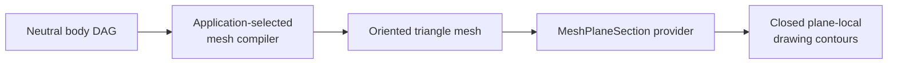

# ADR 0033: Mesh plane sections are an explicit approximation tier

- Status: Accepted
- Date: 2026-09-01
- Package ownership amended by: [0035](./0035-nested-ownership-and-capability-contracts.md)

## Context

Applications need to derive plane-local drawing geometry from evaluated solids. This is a geometry-kernel operation: source-format adapters may select an authored drawing representation or lower body intent, but they must not own solid/plane intersection algorithms.

Axiolid's graph compiler currently stores operation results as `TriMesh`. `ExactBRep` exists as an analytic result contract, but there is no validated closed `ExactSolid`, no graph persistence for exact results, and no general analytic surface/plane intersection and trim-stitching path. An exact-only section API would therefore not execute the current graph result and would not unblock applications.

A mesh section is useful now, but it must not be presented as an exact section of the source analytic body. Its contours inherit every approximation already present in the input mesh.

## Decision

Add a backend-neutral `MeshPlaneSection` capability in `axiolid-mesh-section-contract` and a portable correctness oracle, `ScalarSection`, in `axiolid-reference`.

The operation accepts:

- a finite, non-empty, outward-oriented, closed two-manifold `TriMesh`;
- a finite right-handed orthonormal `Frame3`, whose local XY plane is the section plane and whose X/Y axes define output coordinates;
- explicit source, output-vertex, and contour limits;
- ordinary `ExecutionOptions` for tolerance, cancellation, device policy, and scratch-memory budget.

It returns zero or more closed plane-local polylines. The terminal point is implicit. Evidence states that the result was derived from the supplied mesh and records source-triangle and output counts. The contract does not classify loops as regions, exteriors, or holes.

The registry:

- validates source limits and the section frame before provider dispatch;
- requires non-empty, positive-volume, outward-oriented, closed two-manifold input;
- precharges the checked vector-backed source audit and provider scratch before any source-sized allocation, using the larger sequential peak;
- validates finite, closed, non-duplicated result contours and evidence counts;
- permits provider fallback only for unavailable or unsupported providers.

The scalar oracle:

- classifies every source vertex with certified `orient3d` against the affine plane represented by `origin`, `origin + x`, and `origin + y`;
- keys intersections by source vertex and undirected source edge rather than tolerance-based point welding;
- resolves an edge lying on the plane from both incident face signs;
- requires the section graph to have degree two and assembles deterministic cycles;
- projects into the supplied frame, removes geometrically redundant collinear tessellation vertices, and normalizes each emitted cycle counter-clockwise;
- polls cancellation and enforces output limits before partial results escape.

A source triangle wholly contained in the plane is a two-dimensional overlap, not a uniquely defined curve. The first provider refuses that case. It also refuses non-manifold/open section graphs rather than repairing them heuristically. The source audit proves finite, positive-volume, consistently wound closed two-manifold topology; it does not certify global freedom from triangle self-intersection.

## Consequences

The current executable path is:

This unblocks mesh-derived manufactured plan linework while preserving provenance. Downstream code must keep the mesh approximation visible and may not relabel it as an exact analytic section.

The contract is source-format neutral. Placement, units, context selection, representation policy, region semantics, and authoring of a drawing/model entity remain consumer responsibilities.

## Rejected alternatives

### Put sectioning in a format adapter

Rejected. It duplicates geometry algorithms across consumers and reverses the dependency boundary.

### Weld independently computed triangle intersections by tolerance

Rejected. Proximity does not prove topology and can join separate contours or leave cracks. Source-edge identity supplies the exact connectivity already present in the mesh.

### Claim an exact B-rep section immediately

Rejected. A general closed exact-solid contract and analytic section-curve pipeline do not exist yet. An API without an executable producer would be a capability claim without implementation.

### Treat coplanar triangles as arbitrary boundary segments

Rejected. A plane overlapping a surface patch has two-dimensional intersection. Choosing triangle edges would expose tessellation artifacts as geometric boundaries.

## Follow-up

The exact tier remains separate work:

1. define and validate `ExactSolid` rather than equating a connected `ExactBRep` with a closed body;
2. carry exact operation results through graph execution;
3. implement certified plane/support-surface intersections, trim clipping, seam ownership, and deterministic curve stitching;
4. represent analytic section curves and explicit unresolved/refusal outcomes;
5. add planar arrangement and containment classification when consumers need filled regions or exterior/hole semantics.

Periodic support surfaces additionally require period-aware trim and seam ownership; neutral closure metadata must not be reinterpreted as an exact periodic schema.
