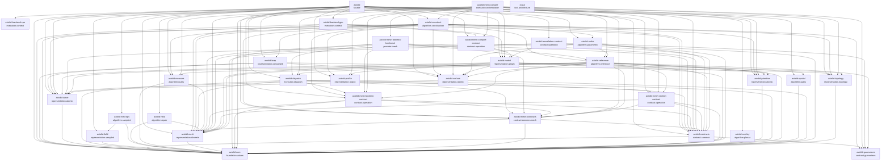

<!-- Generated by `cargo xtask architecture docs`; do not edit manually. -->

# Axiolid dependency graph

Edges point from a package to an internal package it depends on.

```mermaid
graph TD
    accTitle: Axiolid internal package dependency graph
    accDescr: Each arrow points from a package to another internal package it depends on.
    axiolid["axiolid\nfacade"]
    axiolid_backend_cpu["axiolid-backend-cpu\nexecution.context"]
    axiolid_backend_gpu["axiolid-backend-gpu\nexecution.context"]
    axiolid_brep["axiolid-brep\nrepresentation.composed"]
    axiolid_construct["axiolid-construct\nalgorithm.construction"]
    axiolid_contracts["axiolid-contracts\ncontract.common"]
    axiolid_core["axiolid-core\nfoundation.values"]
    axiolid_curve["axiolid-curve\nrepresentation.atomic"]
    axiolid_dispatch["axiolid-dispatch\nexecution.dispatch"]
    axiolid_field["axiolid-field\nrepresentation.sampled"]
    axiolid_field_ops["axiolid-field-ops\nalgorithm.sampled"]
    axiolid_guarantees["axiolid-guarantees\ncontract.guarantees"]
    axiolid_heal["axiolid-heal\nalgorithm.repair"]
    axiolid_measure["axiolid-measure\nalgorithm.query"]
    axiolid_mesh["axiolid-mesh\nrepresentation.discrete"]
    axiolid_mesh_boolean_boolmesh["axiolid-mesh-boolean-boolmesh\nprovider.mesh"]
    axiolid_mesh_boolean_contract["axiolid-mesh-boolean-contract\ncontract.operation"]
    axiolid_mesh_compile["axiolid-mesh-compile\nexecution.orchestration"]
    axiolid_mesh_compile_contract["axiolid-mesh-compile-contract\ncontract.operation"]
    axiolid_mesh_contracts["axiolid-mesh-contracts\ncontract.common.mesh"]
    axiolid_mesh_section_contract["axiolid-mesh-section-contract\ncontract.operation"]
    axiolid_model["axiolid-model\nrepresentation.graph"]
    axiolid_nurbs["axiolid-nurbs\nalgorithm.parametric"]
    axiolid_overlay["axiolid-overlay\nalgorithm.planar"]
    axiolid_primitive["axiolid-primitive\nrepresentation.atomic"]
    axiolid_profile["axiolid-profile\nrepresentation.region"]
    axiolid_reference["axiolid-reference\nalgorithm.reference"]
    axiolid_spatial["axiolid-spatial\nalgorithm.query"]
    axiolid_surface["axiolid-surface\nrepresentation.atomic"]
    axiolid_tessellation_contract["axiolid-tessellation-contract\ncontract.operation"]
    axiolid_topology["axiolid-topology\nrepresentation.topology"]
    xtask["xtask\ntool.architecture"]
    axiolid --> axiolid_backend_cpu
    axiolid --> axiolid_backend_gpu
    axiolid --> axiolid_brep
    axiolid --> axiolid_construct
    axiolid --> axiolid_contracts
    axiolid --> axiolid_core
    axiolid --> axiolid_curve
    axiolid --> axiolid_dispatch
    axiolid --> axiolid_field
    axiolid --> axiolid_field_ops
    axiolid --> axiolid_heal
    axiolid --> axiolid_measure
    axiolid --> axiolid_mesh
    axiolid --> axiolid_mesh_boolean_contract
    axiolid --> axiolid_mesh_compile_contract
    axiolid --> axiolid_mesh_contracts
    axiolid --> axiolid_mesh_section_contract
    axiolid --> axiolid_model
    axiolid --> axiolid_nurbs
    axiolid --> axiolid_overlay
    axiolid --> axiolid_primitive
    axiolid --> axiolid_profile
    axiolid --> axiolid_spatial
    axiolid --> axiolid_surface
    axiolid --> axiolid_tessellation_contract
    axiolid --> axiolid_topology
    axiolid_backend_gpu --> axiolid_contracts
    axiolid_backend_gpu --> axiolid_core
    axiolid_backend_gpu --> axiolid_mesh
    axiolid_backend_gpu --> axiolid_mesh_compile_contract
    axiolid_backend_gpu --> axiolid_model
    axiolid_brep --> axiolid_core
    axiolid_brep --> axiolid_curve
    axiolid_brep --> axiolid_surface
    axiolid_brep --> axiolid_topology
    axiolid_construct --> axiolid_brep
    axiolid_construct --> axiolid_contracts
    axiolid_construct --> axiolid_core
    axiolid_construct --> axiolid_curve
    axiolid_construct --> axiolid_guarantees
    axiolid_construct --> axiolid_measure
    axiolid_construct --> axiolid_mesh
    axiolid_construct --> axiolid_mesh_boolean_contract
    axiolid_construct --> axiolid_mesh_contracts
    axiolid_construct --> axiolid_nurbs
    axiolid_construct --> axiolid_primitive
    axiolid_construct --> axiolid_profile
    axiolid_construct --> axiolid_reference
    axiolid_construct --> axiolid_surface
    axiolid_construct --> axiolid_topology
    axiolid_contracts --> axiolid_core
    axiolid_contracts --> axiolid_guarantees
    axiolid_curve --> axiolid_core
    axiolid_dispatch --> axiolid_contracts
    axiolid_dispatch --> axiolid_core
    axiolid_dispatch --> axiolid_mesh
    axiolid_dispatch --> axiolid_mesh_boolean_contract
    axiolid_dispatch --> axiolid_mesh_contracts
    axiolid_dispatch --> axiolid_mesh_section_contract
    axiolid_field --> axiolid_core
    axiolid_field_ops --> axiolid_core
    axiolid_field_ops --> axiolid_field
    axiolid_heal --> axiolid_core
    axiolid_heal --> axiolid_mesh
    axiolid_measure --> axiolid_core
    axiolid_measure --> axiolid_mesh
    axiolid_mesh --> axiolid_core
    axiolid_mesh_boolean_boolmesh --> axiolid_contracts
    axiolid_mesh_boolean_boolmesh --> axiolid_core
    axiolid_mesh_boolean_boolmesh --> axiolid_dispatch
    axiolid_mesh_boolean_boolmesh --> axiolid_mesh
    axiolid_mesh_boolean_boolmesh --> axiolid_mesh_boolean_contract
    axiolid_mesh_boolean_boolmesh --> axiolid_mesh_contracts
    axiolid_mesh_boolean_boolmesh --> axiolid_reference
    axiolid_mesh_boolean_contract --> axiolid_contracts
    axiolid_mesh_boolean_contract --> axiolid_core
    axiolid_mesh_boolean_contract --> axiolid_mesh
    axiolid_mesh_boolean_contract --> axiolid_mesh_contracts
    axiolid_mesh_compile --> axiolid_construct
    axiolid_mesh_compile --> axiolid_contracts
    axiolid_mesh_compile --> axiolid_core
    axiolid_mesh_compile --> axiolid_curve
    axiolid_mesh_compile --> axiolid_dispatch
    axiolid_mesh_compile --> axiolid_guarantees
    axiolid_mesh_compile --> axiolid_measure
    axiolid_mesh_compile --> axiolid_mesh
    axiolid_mesh_compile --> axiolid_mesh_boolean_boolmesh
    axiolid_mesh_compile --> axiolid_mesh_boolean_contract
    axiolid_mesh_compile --> axiolid_mesh_compile_contract
    axiolid_mesh_compile --> axiolid_mesh_contracts
    axiolid_mesh_compile --> axiolid_mesh_section_contract
    axiolid_mesh_compile --> axiolid_model
    axiolid_mesh_compile --> axiolid_primitive
    axiolid_mesh_compile --> axiolid_profile
    axiolid_mesh_compile --> axiolid_reference
    axiolid_mesh_compile --> axiolid_surface
    axiolid_mesh_compile --> axiolid_topology
    axiolid_mesh_compile_contract --> axiolid_contracts
    axiolid_mesh_compile_contract --> axiolid_mesh
    axiolid_mesh_compile_contract --> axiolid_model
    axiolid_mesh_contracts --> axiolid_contracts
    axiolid_mesh_contracts --> axiolid_core
    axiolid_mesh_contracts --> axiolid_mesh
    axiolid_mesh_section_contract --> axiolid_contracts
    axiolid_mesh_section_contract --> axiolid_core
    axiolid_mesh_section_contract --> axiolid_mesh
    axiolid_mesh_section_contract --> axiolid_mesh_contracts
    axiolid_model --> axiolid_core
    axiolid_model --> axiolid_curve
    axiolid_model --> axiolid_mesh
    axiolid_model --> axiolid_primitive
    axiolid_model --> axiolid_profile
    axiolid_model --> axiolid_surface
    axiolid_model --> axiolid_topology
    axiolid_nurbs --> axiolid_contracts
    axiolid_nurbs --> axiolid_core
    axiolid_nurbs --> axiolid_curve
    axiolid_nurbs --> axiolid_guarantees
    axiolid_nurbs --> axiolid_reference
    axiolid_nurbs --> axiolid_surface
    axiolid_overlay --> axiolid_core
    axiolid_primitive --> axiolid_core
    axiolid_profile --> axiolid_core
    axiolid_profile --> axiolid_curve
    axiolid_reference --> axiolid_contracts
    axiolid_reference --> axiolid_core
    axiolid_reference --> axiolid_curve
    axiolid_reference --> axiolid_dispatch
    axiolid_reference --> axiolid_guarantees
    axiolid_reference --> axiolid_measure
    axiolid_reference --> axiolid_mesh
    axiolid_reference --> axiolid_mesh_boolean_contract
    axiolid_reference --> axiolid_mesh_contracts
    axiolid_reference --> axiolid_mesh_section_contract
    axiolid_reference --> axiolid_primitive
    axiolid_reference --> axiolid_spatial
    axiolid_reference --> axiolid_surface
    axiolid_spatial --> axiolid_core
    axiolid_surface --> axiolid_core
    axiolid_surface --> axiolid_curve
    axiolid_tessellation_contract --> axiolid_contracts
    axiolid_tessellation_contract --> axiolid_core
    axiolid_tessellation_contract --> axiolid_mesh
    axiolid_tessellation_contract --> axiolid_model
    axiolid_topology --> axiolid_core
```
