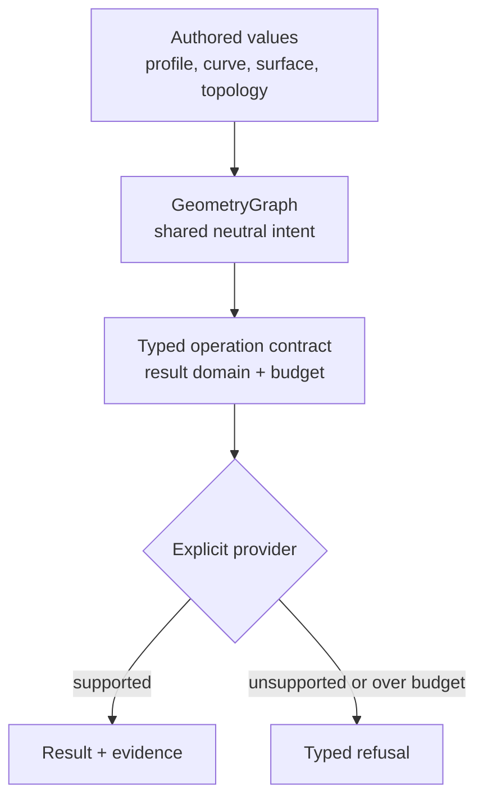
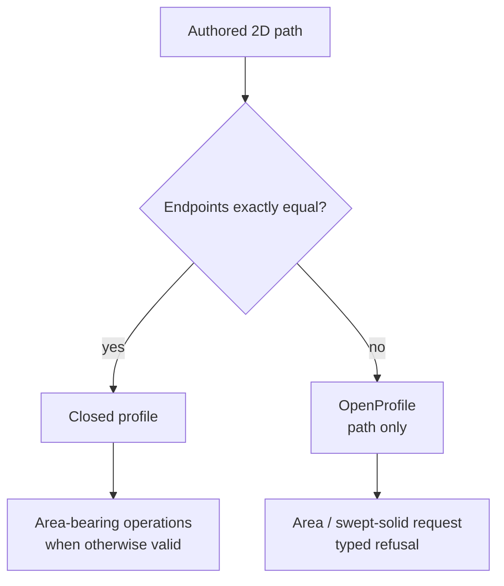

# Geometry concepts and evidence

Axiolid separates **authored geometry**, **operation contracts**, and **execution
results**. This page uses small exact examples to explain those layers. It is not
a claim that every represented curve, surface, or solid already has a production
evaluator; use the [capability matrix](/capabilities) for that status.

## One shape, three responsibilities



The graph does not choose a provider. A contract does not promise that an
implementation exists. This distinction keeps representation breadth from being
mistaken for executable capability.

## Closed profile and straight extrusion

Take the counter-clockwise triangular profile

$$
P = \bigl((0,0),\,(2,0),\,(0,1)\bigr)
$$

and extrude it by $h=1$ along the positive $z$ axis. Its area and expected volume
are

$$
\begin{aligned}
A(P) &= \frac{1}{2}\cdot 2\cdot 1 = 1,\\
V &= A(P)\lvert h\rvert = 1.
\end{aligned}
$$

The STL below is the resulting closed, outward-oriented triangle mesh. On
GitHub it uses the native STL viewer; on the documentation site the same source
is parsed locally in the browser. Drag to rotate and scroll or pinch to zoom.

```stl
solid triangular_prism
  facet normal 0 0 -1
    outer loop
      vertex 0 1 0
      vertex 2 0 0
      vertex 0 0 0
    endloop
  endfacet
  facet normal 0 0 1
    outer loop
      vertex 0 0 1
      vertex 2 0 1
      vertex 0 1 1
    endloop
  endfacet
  facet normal 0 -1 0
    outer loop
      vertex 0 0 0
      vertex 2 0 0
      vertex 2 0 1
    endloop
  endfacet
  facet normal 0 -1 0
    outer loop
      vertex 0 0 0
      vertex 2 0 1
      vertex 0 0 1
    endloop
  endfacet
  facet normal 0.4472135955 0.894427191 0
    outer loop
      vertex 2 0 0
      vertex 0 1 0
      vertex 0 1 1
    endloop
  endfacet
  facet normal 0.4472135955 0.894427191 0
    outer loop
      vertex 2 0 0
      vertex 0 1 1
      vertex 2 0 1
    endloop
  endfacet
  facet normal -1 0 0
    outer loop
      vertex 0 1 0
      vertex 0 0 0
      vertex 0 0 1
    endloop
  endfacet
  facet normal -1 0 0
    outer loop
      vertex 0 1 0
      vertex 0 0 1
      vertex 0 1 1
    endloop
  endfacet
endsolid triangular_prism
```

This identity is executable evidence in
[`axiolid-construct/tests/extrusion_volume.rs`](https://github.com/axiolid/kernel/blob/main/crates/algorithms/construction/construct/tests/extrusion_volume.rs).
It applies to a valid closed profile and a straight extrusion; it does not turn an
open profile into an area.

## Orientation and signed volume

For an outward-oriented closed triangle mesh with triangles
$(\mathbf a_i,\mathbf b_i,\mathbf c_i)$, the signed tetrahedral sum is

$$
V_s=\frac{1}{6}\sum_i
\mathbf a_i\cdot\left(\mathbf b_i\times\mathbf c_i\right).
$$

Consistent outward winding gives a positive volume; reversing every face changes
the sign. The expression is not a validity test by itself: a torn shell or
non-manifold mesh must be rejected before treating $V_s$ as enclosed volume.

The unit right tetrahedron makes the factor $1/6$ visible:

```stl
solid unit_tetrahedron
  facet normal 0 0 -1
    outer loop
      vertex 0 0 0
      vertex 0 1 0
      vertex 1 0 0
    endloop
  endfacet
  facet normal 0 -1 0
    outer loop
      vertex 0 0 0
      vertex 1 0 0
      vertex 0 0 1
    endloop
  endfacet
  facet normal -1 0 0
    outer loop
      vertex 0 0 0
      vertex 0 0 1
      vertex 0 1 0
    endloop
  endfacet
  facet normal 0.5773502692 0.5773502692 0.5773502692
    outer loop
      vertex 1 0 0
      vertex 0 1 0
      vertex 0 0 1
    endloop
  endfacet
endsolid unit_tetrahedron
```

Here $V_s=1/6$. Axiolid's mesh-audit and measurement paths keep manifold checks
separate from the integral so that a plausible number cannot certify invalid
topology.

## Tolerance is operation input

Axiolid does not hide one global epsilon. A linear tolerance $\varepsilon_l$
means an operation may classify points as coincident only under an explicit
caller-selected bound such as

$$
\lVert \mathbf p-\mathbf q \rVert_2 \leq \varepsilon_l.
$$

A tessellation or flattening request may additionally carry a chord-deviation
budget $c$. The useful contract is not “produce enough triangles”; it is

$$
\max_{u\in [u_0,u_1]}
\operatorname{dist}\!\left(C(u),\,\overline{\mathbf p_0\mathbf p_1}\right)
\leq c,
$$

for each accepted segment, subject to an explicit work budget. If the provider
cannot establish its bounded evidence within that budget, it must refuse rather
than silently loosen $c$.

## Rational B-spline representation

For control points $\mathbf P_i$, weights $w_i>0$, and basis functions
$N_{i,p}(u)$, a rational B-spline curve is

$$
C(u)=
\frac{\sum_i N_{i,p}(u)w_i\mathbf P_i}
     {\sum_i N_{i,p}(u)w_i}.
$$

Axiolid represents polynomial and rational B-spline curves and surfaces and has
opt-in scalar reference algorithms for documented subsets. Representation alone
does not imply global intersection, projection, or tessellation coverage; those
claims stay in the [capability matrix](/capabilities) and operation-specific
ADRs.

## Open profiles do not acquire area



`OpenProfile` preserves authored finite, bounded, non-closed 2D intent. It has no
implicit width and must not be promoted to a swept area. This is the neutral
contract used by `ifc-geometry` for `IfcArbitraryOpenProfileDef`.

## What the models prove—and what they do not

The embedded STL examples prove that the documentation renderer can display the
listed triangles. They are explanatory fixtures, not evidence for general solid
construction, Boolean robustness, or exact B-rep coverage. Production claims
require tests, conformance evidence, and the bounded refusal behavior documented
for each operation.
