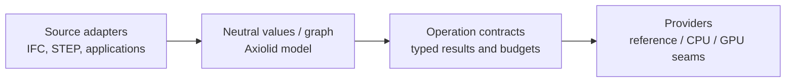

## A kernel is a boundary, not a format parser

Axiolid is the neutral middle layer for applications that import, construct, query, compile, or render geometry. It is designed so source-format semantics stay in adapters and execution choices stay in providers.

That separation keeps a mesh-only user from paying for topology or GPU APIs, lets a future adapter reuse the same representation, and makes backend claims inspectable rather than implicit.

## Start with evidence

Axiolid is early software. The project deliberately distinguishes storage, contracts, and algorithms that are actually exercised. Before choosing it for an application, read:

- [Getting started](/guide/getting-started) for dependency and feature selection.
- [Capabilities](/capabilities) for what is implemented, represented, or intentionally deferred.
- [Architecture](/architecture) for dependency direction and execution seams.
- [Geometry concepts](/guide/geometry-concepts) for interactive STL examples,
  equations, tolerance, orientation, and open-profile semantics.
- [Architecture decisions](/adr/0009-layered-geometry-dag) for the non-negotiable design choices.
- [Roadmap](/ROADMAP) and [changelog](/CHANGELOG) for current direction and user-visible history.
