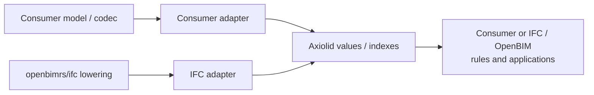

# Low-level geometry migration

## Goal

Migrate only source-, vendor-, and IFC-agnostic geometry capabilities from
prior-art consumer workspaces into Axiolid. Axiolid remains pure Rust and its
crates must not contain model identities, IFC entities, codecs, rule names,
accessibility policy, or application outcomes.

## Architecture

Adapters own conversion, caller identity, provenance, source units, and
application policy. Axiolid owns opaque caller keys plus neutral coordinates,
bounds, topology, predicates, and query algorithms.

## Migration rule

Every chunk follows: specify behavior and deterministic ordering; implement in
the narrow Axiolid crate; test against an independent oracle and the current
consumer result; add a consumer-side adapter; rewire one consumer; then delete
no legacy path until compatibility evidence passes.

No benchmark claim is accepted without a release-mode baseline,
output-equivalence check, and representative workload. Parallel/GPU
implementations are future providers behind stable query contracts, not a
reason to introduce premature parallelism or vendor APIs.

## Initial chunks

1. **BVH broad phase (active):** a consumer `spatial/bvh` equivalent ->
   `axiolid-spatial`. Generic keys/AABBs only; deterministic query visitation
   and malformed-bounds policy. Rewire clash/distance candidate production
   through an adapter.
2. **Mesh diagnostics/repair:** compare neutral mesh validation, topology, and
   repair behavior; port only missing algorithms into `axiolid-mesh`/`axiolid-heal`.
3. **2D profile operations:** triangulation, robust polygon operations,
   coverage and paths into the existing profile/curve seams.
4. **Solid/query algorithms:** CSG, ray/containment/distance only where an
   Axiolid operation contract and scalar correctness oracle exist.

## Explicit exclusions

Stair, ramp, vertical-access and head-clearance policy, source-native
compatibility behavior, IFC placement/lowering, and checker/report policy
remain above Axiolid in consumer or application adapters and rules.

## Capability matrix

| Consumer area | Target layer | Status | Migration rule |
|---|---|---|---|
| `spatial/bvh` | `axiolid-spatial` | completed | Consumer retains labels/AABBs; adapter delegates all hierarchy work. |
| `mesh/validate` | `axiolid-mesh` | completed | Adapter uses a zero-copy mesh view and preserves consumer health outcomes. |
| `profile/triangulate` | `axiolid-reference` / `axiolid-tessellation-contract` | partial | Simple loops use the certified Axiolid scalar adapter; holes remain blocked pending a maintained constrained backend. |
| `predicates/*` and narrow phase | `axiolid-reference` / `axiolid-measure` | partial | Certified segment/triangle contact and deterministic segment/triangle-pair metric witnesses are implemented; batch/provider execution and remaining intersection families remain separate slices. |
| `query/{clash,distance,containment,footprint,portal}` | Axiolid query crates | inventory | Separate reusable query kernel from consumer identifiers and rule interpretation. |
| `solid/*` | `axiolid-mesh-boolean-boolmesh` / `axiolid-mesh-compile` | inventory | Do not import native CSG bindings or consumer representation policy. |
| Stair, ramp, vertical-access, head-clearance policy | Consumer rules/domain | excluded | Extract only generic slice/distance/clearance primitives that a neutral API can express. |

Every candidate requires: API contract and tolerance policy, no IFC/consumer/rule
imports, deterministic scalar tests plus a consumer adapter differential test,
and an explicit CPU-batching/GPU-provider assessment before performance work.
